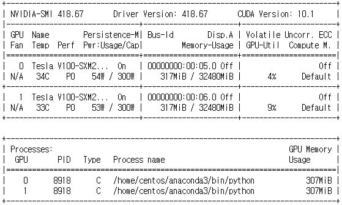
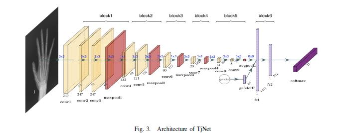
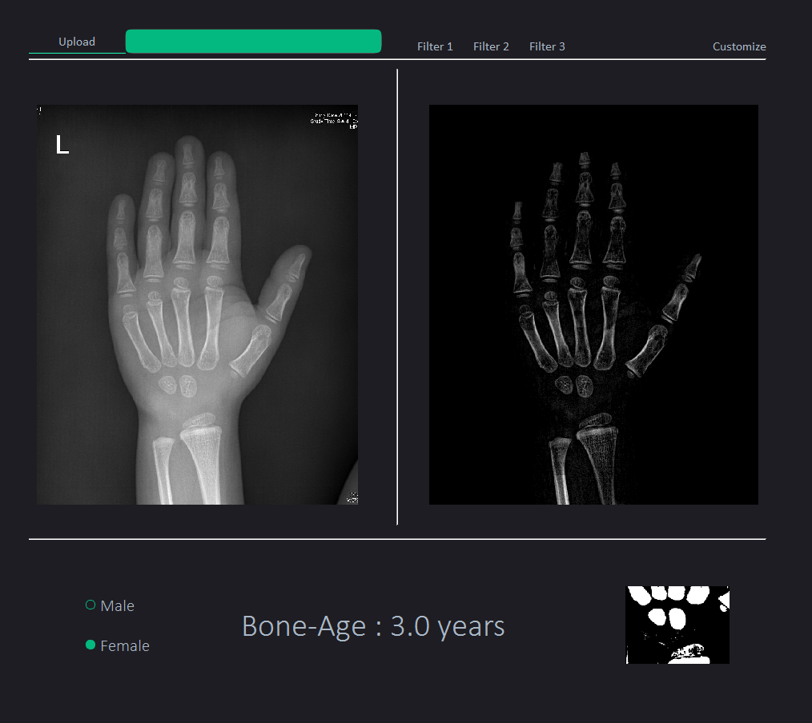

# Boneage_prediction_CNN   
자동화된 소아(1~10세)골연령 측정 프로그램을 개발(진행중)   
- key_library : OPENCV, TENSORFLOW(KERAS), PYQT
---------------
## 개요
1. 자동 전처리 기능으로 뼈를 강조하고 골연령 판단에 중요한 ROI영역을 추출해 참고자료 제공
2. CNN을 통해 골연령을 예측
3. PYQT로 사진을 업로드 하면 참고자료와 예측 골연령을 제공하는 어플리케이션 개발
---------------------
## 이미지 전처리
### Note
- 사진들 간의 명도와 채도의 차이가 큼
- 손 외의 다른 물체들이 존재

### 1차 전처리
1. 마스크 생성(다른 물체를 제거하기 위해)
- 메디안 블러
- 침식연산
- 이진화
- 칸투어 계산 후 영역크기가 가장넓은 칸투어 추출

2. 뼈 강조
- TOPHAT모폴로지
- 가우시안 블러
- 이진화

### 2차 전처리
1. 마스크 생성(개선사항)
- 이미지를 밝기를 분리할수 있는 LAB채널로 변환
- 메디안 블러
- 이진화
- 칸투어 계산 후 영역크기가 가장넓은 칸투어 추출   
2. 마스크 기준으로 좌우 상하 영역 제거

3. 뼈강조
- contrast 함수
- equalization   
4. 회전  

5. ROI
- convexhull을 사용해서 기준이 되는 지점 찾기
- 엄지-손목 경계점 기준으로 CarpalBone ROI 자르기
- 뼈강조   

## Deep_Learning(CNN)
### Note
- 고성능컴퓨터에서 GPU를 사용해서 학습 속도 상향   
</img> 
- ImageNet에서 좋은 성과를 낸 모델위주로 학습
- 이미지 전처리 과정별로 모델 학습해보기
- gender요소를 추가해서 model을 concatenate한 모델 만들기
### Data
- 국내 소아과 X-ray 사진 (1~10세 남녀 총 391명)
- RSNA Bone Age Contest at Kaggle(<https://www.kaggle.com/kmader/rsna-bone-age>)

### ROI기반 CNN
- 데이터 파편화를 방지하기 위해 메모리 할당
- input_data가 두개이므로 data_pipeline을 이용해 input값을 만들어주는 data_generator 만들기
- ImageNet에서 좋은 성과를 내엇던 Xception, ResNet, vgg 들과 tjnet을 사용해서 모델학습
- 모델 평가후 Weight 저장
- 현재 MAE = 0.41년 (사용모델 tjnet) 
</img> 

### 원본 CNN
- 데이터 양이 적기때문에 Kaggle의 데이터 약 12000장의 사진을 기준으로 학습
- ROI기반 CNN과 동일하게 gender를 포함한 모델링으로 학습
- 현재 MAE = 0.93년 (모델 위와 동일)

## PYQT
### 현재 진행중이므로 이미지만 첨부(2020.08.05기준) 
</img> 
